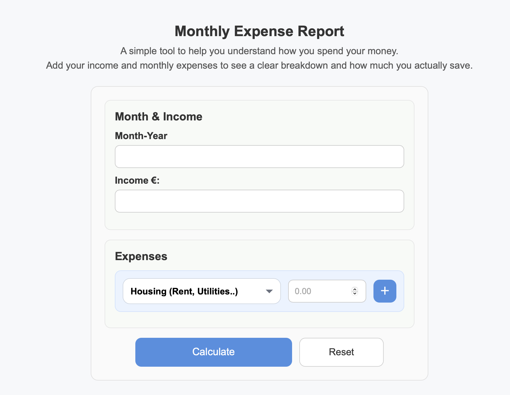
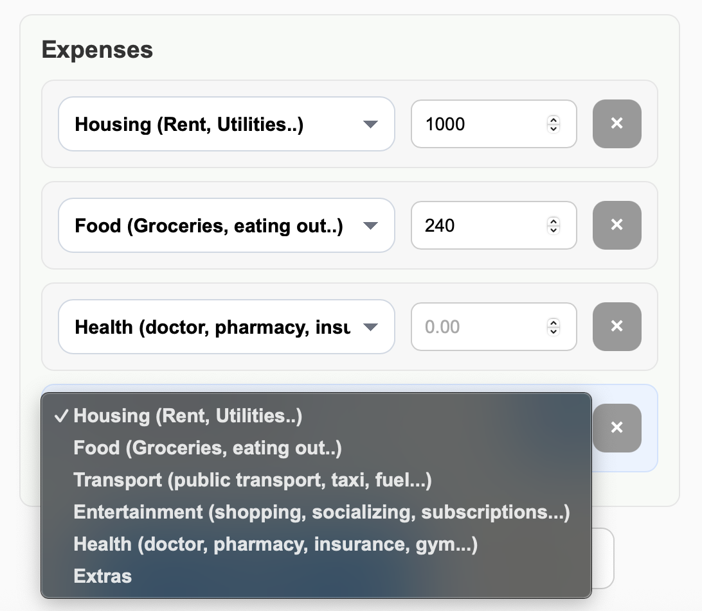
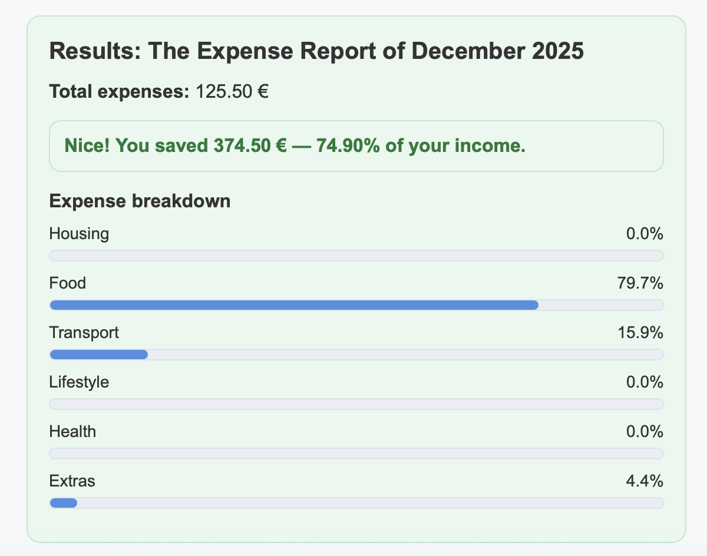
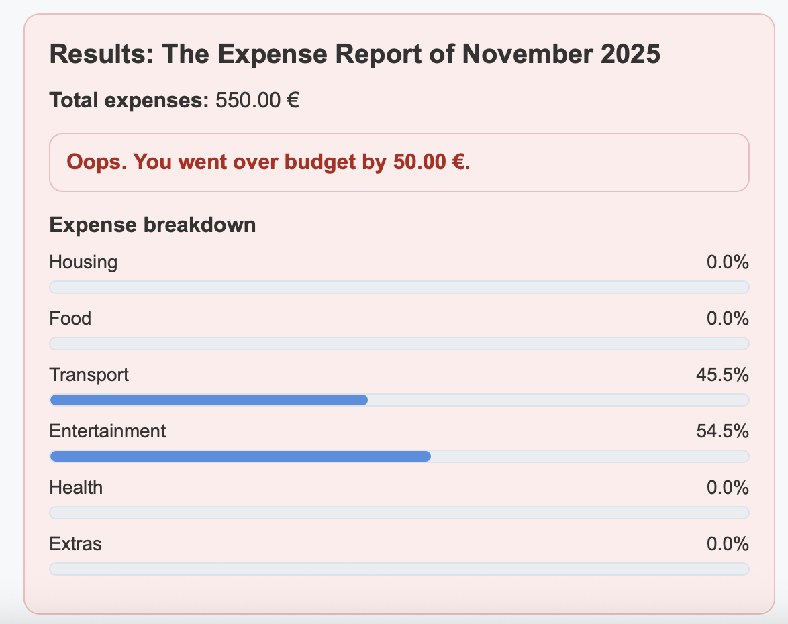

# Monthly Expense Report

A clean and user-friendly **Flask web application** that helps users analyze their monthly income and expenses.
The app calculates total expenses, remaining savings, savings rate, and displays a visual percentage breakdown
of expenses by category.

🔗 **You can try how it works from the live demo: [Let's go](https://selen23.pythonanywhere.com)


---
## ✨ Features
- Enter monthly income and period
- Add multiple expenses dynamically from categorized expenses (housing, food, transport, health, etc.)
- Automatic calculation of:
  - Total expenses
  - Remaining money
  - Savings rate (% of income)
- Visual expense breakdown with progress bars
- Feedback for overspending vs saving

---
## 🖼️ What the app looks like

### Home


### Adding categories


### Results – Saving


### Results – Overspending



---
## ⚙️ Requirements

- Python **3.10+**
- Flask
- WTForms

---
## ▶️ How to Run Locally

1. Clone the repository:
```bash
git clone https://github.com/selenozkan/monthly-expense-report.git
cd monthly-expense-report
```

2. (Optional) Create and activate a virtual environment:
```bash
python -m venv venv
source venv/bin/activate   # macOS / Linux
```

3. Install dependencies:
```bash
pip install flask wtforms
```

4. Run the application:
```bash
python main.py
```

---

## 🗂️ Project Structure

```text
MonthlyExpenseReport/
│
├── main.py                 # Flask app entry point
├── month_budget/
│   ├── budget.py           # Core business logic (OOP)
│   └── design.txt          # Design notes
│   └── main.py             # initial testing of the project from terminal before moving to flask
│
├── templates/
│   └── index.html          # Main HTML template
│
├── static/
    └── main.css            # Styling
```
